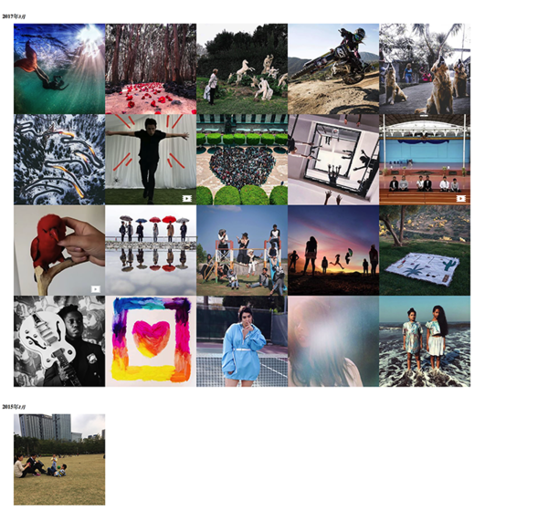

# photoswipe_album
用photoswipe制作一个相册
按照[hexo yilia](http://litten.me/photos/)主题相册，依葫芦画瓢制作的一个相册，支持图片，视频展示
## 用法
```
$ git clone https://github.com/elsonwx/photoswipe_album.git
$ cd photoswipe_album
$ npm install http-server -g
$ http-server
```
## photos_data.json
可从图床或者instagram爬虫生成此文件，或者写一个脚本从图片文件夹生成此文件。用crontab自动化运行任务

## 参考
  - [photoswipe](http://photoswipe.com/documentation/getting-started.html) 
  - [hexo yilia主题相册](https://github.com/litten/BlogBackup/tree/master/source/photos)

## 效果



